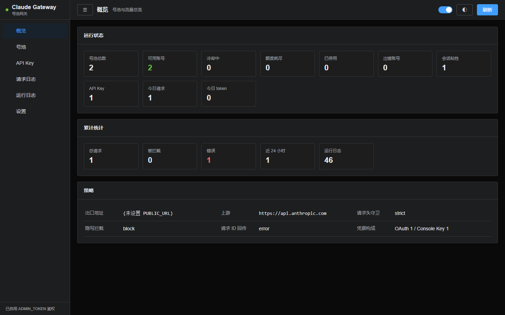

# 面板

面板是**零依赖、零构建、单进程**的单页应用：样式与脚本都内联在 HTML 里，
抄的是 Element Plus 的类名与视觉规范，但行为是自己实现的。

## 为什么不用 Element Plus

引入 Vue + Element Plus 就要加一条前端构建链，部署从「跑一个文件」变成「先 build」。
这个网关的定位是丢到服务器上就能跑，所以只借设计语言，不借运行时。

## 文件结构

| 文件 | 职责 |
|---|---|
| `tokens.ts` | 设计 token：调色板、间距、圆角、阴影，亮暗两套。换皮只动这里 |
| `components.ts` | 组件样式，类名与 Element 对齐（el-button / el-table / el-dialog …） |
| `client.ts` | 运行时：DOM 构建、消息提示、对话框、可排序表格、分页、路由、自动刷新 |
| `views.ts` | 各页视图：概览 / 号池 / API Key / 请求日志 / 运行日志 / 设置 |
| `shell.ts` | 外壳：布局、侧栏、顶栏，把上面四份拼成一个 HTML |
| `api.ts` | 后端：一个 `/panel/api?action=` 端点，GET 读 POST 写 |

## 六个痛点的对应实现

| 问题 | 做法 |
|---|---|
| 表格难用 | 表头可点排序（带方向指示）、表头吸顶、长文本三行截断、分页带页码、危险行整行标色 |
| 操作路径绕 | 添加账号 / 批量导入 / 创建 Key / 改配额 / 删号删 Key 全部走对话框，不再在页面顶部堆表单 |
| 反馈缺失 | 每个视图先出骨架屏；空态有插图与说明；每次操作都有成功/失败消息；失败信息从后端的 error.message 取 |
| 视觉粗糙 | 统一到 Element 的调色板与间距；侧栏与菜单用 SVG 图标；统计格自适应换行 |
| 移动端不可用 | 窄屏侧栏变抽屉（汉堡按钮 + 遮罩），表格横向滚动，描述列表改单列，统计格缩小 |
| 实时性差 | 每 15 秒自动刷新（可关），顶部开关记忆到 localStorage；「x 秒前」每 10 秒原地更新；对话框打开或页面隐藏时暂停 |

## 路由

hash 路由：`#/overview`、`#/accounts`、`#/keys`、
`#/reqlogs`、`#/rtlogs`、`#/settings`。浏览器前进后退可用。

## 主题

默认暗色，右上角按钮切换，选择记在 localStorage。两套变量都在 `tokens.ts` 里，
靠 `<html data-theme>` 切换。

## 鉴权

管理员令牌从 URL 的 `key` 参数取，取到后存 localStorage；
之后所有请求自动带上。`ADMIN_TOKEN` 没设置时面板不鉴权。
