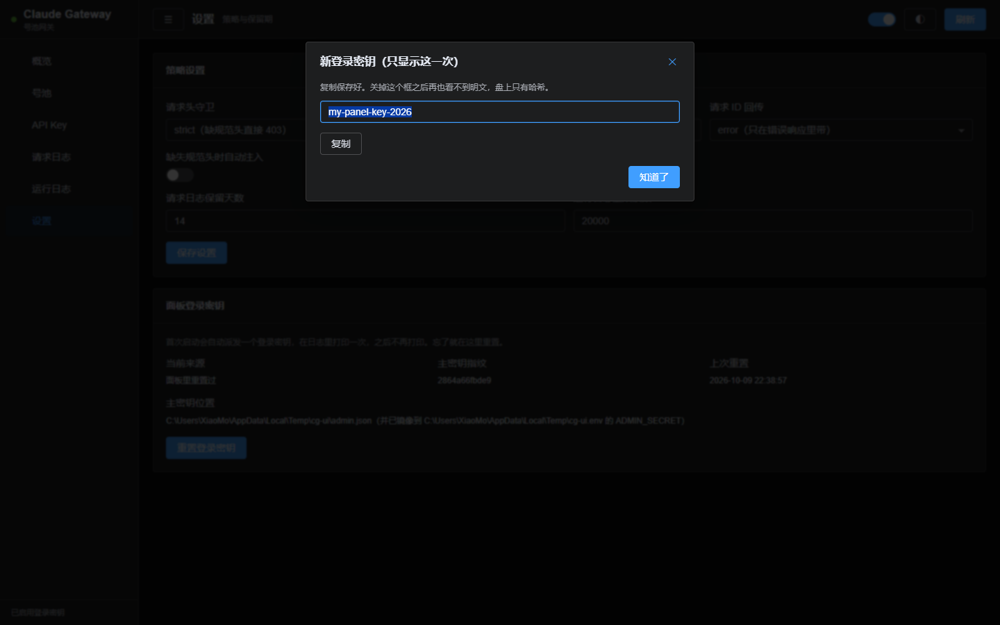
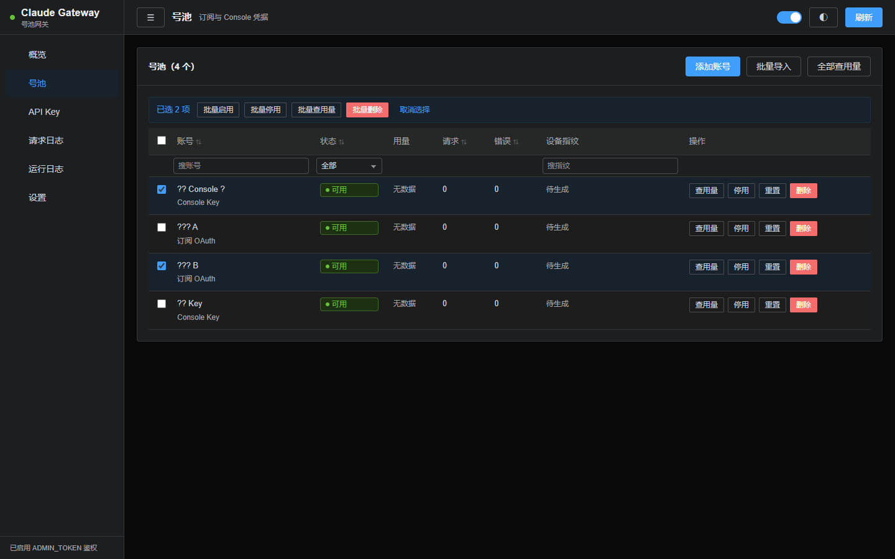

## 鉴权

面板登录密钥**不用自己填**。首次启动会自动派发一个，在控制台日志里打印一次，
形如 `cgk_` 加 32 位 base32。之后每次启动都不再打印。

### 密钥是怎么来的

```text
主密钥 master（64 位 hex）
    │  HMAC-SHA256，单向不可逆
    ▼
登录密钥 cgk_xxxxxxxxxxxxxxxxxxxxxxxxxxxxxxxx
    │  scrypt
    ▼
data/admin.json 里只存哈希
```

- 主密钥首次启动生成，落 `data/admin.json`（0600），并镜像到 `.env` 的 `ADMIN_SECRET`，方便查看与备份
- **单向**：拿到登录密钥推不出主密钥；盘上从头到尾没有登录密钥明文
- 改了 `ADMIN_SECRET`，登录密钥会跟着重新派生，并再打印一次
- **镜像 `.env` 有条件**：只在下面三种情况之一才写 —— `CG_ENV_FILE` 被显式指定、
  `.env` 已经存在、或数据目录还是默认的 `./data`。
  原因是 Bun 会自动加载工作目录的 `.env`，往陌生目录里凭空写一个会污染后续运行。
  Docker 里数据目录通常是 `/data`，这时镜像会跳过 —— 不影响使用，
  主密钥本来就在 `data/admin.json` 里；想让 `.env` 也有，把 `.env` 挂进容器即可

### 面板里怎么用

进面板时若浏览器 localStorage 里没有密钥，弹一个**不可关闭**的对话框索取；
先用一次真实请求校验，错的密钥不写进 localStorage；之后所有调用带 `x-admin-token` 头。
任何一次请求返回 401，就清掉本地密钥并重新弹窗。

密钥**不进 URL**：URL 会留在浏览器历史、Referer 头和服务端访问日志里。
后端的 `?key=` 查询参数保留着，那是给 curl 用的。



### 忘了密钥怎么办

三条路，按方便程度排：

1. 面板「设置」→「重置登录密钥」。可以自定义一个（至少 12 位），也可以留空让系统随机生成。
   **新密钥只在弹出的对话框里显示一次**，关掉就没有明文了
2. 删掉 `data/admin.json` 重启，会重新派发并再打印一次
3. 设 `ADMIN_TOKEN` 环境变量重启。它是逃生口，设了就完全接管鉴权，不派发也不打印

# 面板




面板是**零依赖、零构建、单进程**的单页应用：样式与脚本都内联在 HTML 里，
抄的是 Element Plus 的类名与视觉规范，但行为是自己实现的。

## 为什么不用 Element Plus

引入 Vue + Element Plus 就要加一条前端构建链，部署从「跑一个文件」变成「先 build」。
这个网关的定位是丢到服务器上就能跑，所以只借设计语言，不借运行时。

## 文件结构

| 文件 | 职责 |
|---|---|
| `tokens.ts` | 设计 token：调色板、间距、圆角、阴影，亮暗两套。换皮只动这里 |
| `components.ts` | 组件样式，类名与 Element 对齐（el-button / el-table / el-dialog …） |
| `client.ts` | 运行时：DOM 构建、消息提示、对话框、可排序表格、分页、路由、自动刷新 |
| `views.ts` | 各页视图：概览 / 号池 / API Key / 请求日志 / 运行日志 / 设置 |
| `shell.ts` | 外壳：布局、侧栏、顶栏，把上面四份拼成一个 HTML |
| `api.ts` | 后端：一个 `/panel/api?action=` 端点，GET 读 POST 写 |

## 六个痛点的对应实现

| 问题 | 做法 |
|---|---|
| 表格可用 | 表头可点排序（带方向指示）、表头吸顶、长文本三行截断、**列筛选**（表头下一行，文本或下拉）、分页带页码、危险行整行标色 |
| 操作路径短 | 添加账号 / 批量导入 / 创建 Key / 改配额 / 删号删 Key 全部走对话框；**就地编辑**（点备注名或 Key 名直接改）；**批量操作**（勾选后批量启用 / 停用 / 查用量 / 删除） |
| 反馈缺失 | 每个视图先出骨架屏；空态有插图与说明；每次操作都有成功/失败消息；失败信息从后端的 error.message 取 |
| 视觉粗糙 | 统一到 Element 的调色板与间距；侧栏与菜单用 SVG 图标；统计格自适应换行 |
| 移动端不可用 | 窄屏侧栏变抽屉（汉堡按钮 + 遮罩），表格横向滚动，描述列表改单列，统计格缩小 |
| 实时性 | 每 15 秒自动刷新（可关），顶部开关记忆到 localStorage；「x 秒前」每 10 秒原地更新；对话框打开或页面隐藏时暂停 |

## 列筛选的两种模式

表格的筛选行支持三种写法，差别在于**筛选发生在哪一侧**：

| 写法 | 用在 | 说明 |
|---|---|---|
| `type:"text"` | 号池、API Key | 客户端子串匹配，对不分页的整表是准的 |
| `type:"select"` | 号池的状态、Key 的指纹 | 客户端精确匹配 |
| `type:"slot"` | 两张日志表 | 只把控件挂到列下面，筛选由调用方转成服务端查询参数 |

为什么日志表不能用客户端筛选：它们是服务端分页的，只过滤当前页会骗人。

## 测试

`test/panel.test.ts`（57 项）不跑浏览器，测的是三类契约：

1. **渲染产物** —— 标签配对、viewport、菜单项数、令牌没被写进页面。
2. **内联脚本** —— 用 `new Function` 解析一遍，这是 Node 侧唯一能抓语法错误的手段。
3. **跨文件契约** —— 前端 `CG.api(...)` 调用的每个 action，后端 switch 里都得有；每个路由都得有渲染函数与标题。

还有一组「六个痛点的实现特征都在」的断言，防止以后重构时悄悄丢掉某一项。

## 路由

hash 路由：`#/overview`、`#/accounts`、`#/keys`、
`#/reqlogs`、`#/rtlogs`、`#/settings`。浏览器前进后退可用。

## 主题

默认暗色，右上角按钮切换，选择记在 localStorage。两套变量都在 `tokens.ts` 里，
靠 `<html data-theme>` 切换。

## 添加账号

「号池」页点「添加账号」，三种方式：

| 方式 | 用来做什么 |
|---|---|
| **订阅 OAuth（授权登录）** | 走官方授权拿令牌，**能查订阅额度**。推荐 |
| 订阅 OAuth（粘贴 refresh_token） | 手上已经有 refresh_token，直接贴 |
| Console API Key | 贴 `sk-ant-...`，走 API 计费 |

### 授权登录的两步

1. 点「① 获取授权链接」，生成一个带 PKCE 的授权地址，并给一个在新标签页打开的按钮。
   **对话框不会关** —— 你要切过去登录，回来还得在这个框里粘东西。
2. 登录并授权后，页面会显示一段 code（形如 `xxx#yyy`），整段复制粘进「② 粘贴授权码」，
   点确定。授权码与 `code#state` 两种写法都认。

回调固定走 `https://platform.claude.com/oauth/code/callback`（官方的「手动复制 code」地址），
所以**浏览器和网关不必在同一台机器上** —— 内网部署、远程访问都能用。
想全程自动回调才需要 `localhost` 可达，见下面的 `/login` 一节。

授权会话是一次性的：同一个 state 只能换一次码，重复提交会提示「授权会话已过期」，
重新点「获取授权链接」即可。

### 加完号自动查额度

建号成功后**会自动查一次订阅额度**并落库，不用再手点「查用量」。
过程中会先提示「正在登录并查询额度…」，查到后弹一行摘要（如「额度：5 小时 42% · 7 天 13%」），
号池那一行的额度列也直接就是查好的值。

这条查询有几个刻意的设计：

- **不拖住建号**：账号先建好再查额度，查询失败（超时、代理没开、上游 5xx）只会让那一行显示查询失败，账号照样在
- **超时压到 8 秒**：比常规的 15 秒短，免得面板看起来卡住了
- **窗口 rejected 就封印**：额度接口明说某个窗口已 rejected 时，账号会被标记为额度耗尽并封印到窗口重置时刻，
  这条逻辑与手动「查用量」共用同一份实现
- **Console 模式不查**：Console Key 没有订阅用量接口

### `/login` 那条独立入口

除了面板，还有一个独立的 HTML 页面 `/login`，走的是同一份后端逻辑：

- 用 `localhost` 访问 -> 302 直接跳到授权页，回调自动完成，**不用粘 code**
- 用内网 IP 访问 -> 渲染一个两步页面（新标签页按钮 + code 输入框），与面板里那套一样

想要全自动：把网关端口转发到本机（`ssh -L 8080:127.0.0.1:8080 user@网关`），
再开 `http://localhost:8080/login`。

## 鉴权

面板外壳（`/panel` 返回的那份 HTML）**不要令牌** —— 它就是静态的样式与脚本，
一个字节的数据都不含。数据全在 `/panel/api` 后面，那里才校验。

令牌的来路：

1. 进面板时若 localStorage 里没有令牌，弹一个**不可关闭**的对话框索取。
   藏掉 ✕ 与取消，遮罩点击也不关 —— 没令牌什么都看不到，给个关闭按钮只会让人以为面板坏了。
2. 输入后用一次真实请求（`action=overview`）校验，**错的令牌不写进 localStorage**。
3. 通过后存 localStorage，之后所有接口调用带 `x-admin-token` 头。
4. 任何一次请求返回 401，就清掉本地令牌并重新弹窗，问到了再刷当前页。

令牌**不进 URL**：URL 会留在浏览器历史、Referer 头和服务端访问日志里。
后端的 `?key=` 查询参数保留着，那是给 curl 用的。

面板鉴权**始终启用** —— 没有「未设令牌 = 无鉴权」这个状态。登录密钥首次启动自动派发，
不设任何东西也不会裸奔。

## 添加账号

「订阅 OAuth（授权登录）」走两步卡片：

1. **生成授权链接并完成登录** —— 点「生成授权链接」，然后「打开授权页」在新标签页完成登录。
   链接是只读输入框，旁边有「复制」与「打开授权页」两个按钮；浏览器拦了新窗口就用复制。
2. **把授权码粘回来** —— 授权成功后页面会显示一段 `code#state`，整段粘进第二个输入框，点确定。

建号成功后会顺手查一次额度，并把上游档案里的 `display_name` / `full_name` 当作账号名 ——
不再是「账号 1」这种占位名。粘贴 `refresh_token` 建的号没有 access_token，
名字会在第一次查额度时自动补全。

## 出口自检

「设置 → 出口自检 → 立即检查」会分别用带代理和不带代理各查一次出口 IP：

- 两次**不同** → 出口正常
- 两次**相同** → 代理没生效（请求从本机直出）
- 不带代理那次失败 → 无法判定（内网机器通常如此），不算错

启动时也会自动跑一次，判为代理没生效就拒绝启动，可用 `IP_CHECK=off` 显式跳过。

## API Key

「创建 Key」时明文只显示一次，关掉就再也看不到（盘上只有哈希）。

**换密钥不用删了重建** —— 每行有「重置密钥」：只换明文，名字、配额、限流、绑定账号、指纹策略
全部原样保留。旧密钥立刻失效，新明文同样只显示一次。

## 下拉框

面板里的下拉是自绘的，不是原生 `<select>` —— 原生弹出层由操作系统画，跟面板其它部分两个世界。
自绘的触发器与 `el-input` 同款，弹层挂到 body 上用 fixed 定位（表格的 overflow 裁不到它），
支持键盘（Enter/空格开合、上下键选项、Esc 关闭）。

## 账号

每行有「**刷新信息**」：拉一次账号档案（真名、邮箱、套餐）+ 查一次额度。

用途是修历史遗留的备注名。用粘贴 `refresh_token` 建的号，创建时拿不到真名，
库里的备注名是「账号 3」这类默认值。这种值不一定长得像占位符，
自动补名的启发式可能漏掉，手动刷一次就正了。

列表上的「**全部刷新信息**」批量跑一遍。档案接口拿不到时会在结果里如实报原因，
不会假装刷成功。

（「查用量」只查额度，不动备注名。）

## 模型目录

「设置 → 模型目录」能看到清单来源（远端目录 / 磁盘缓存 / 内置兜底）、条数、
目录版本、上次拉取时间和上次错误，还有「重新拉取」按钮。

下面的勾选清单控制**对外返回哪些模型**：取消勾选即隐藏，保存后立刻生效。
被 `MODEL_DISABLED` 钉死的显示为禁用框。
